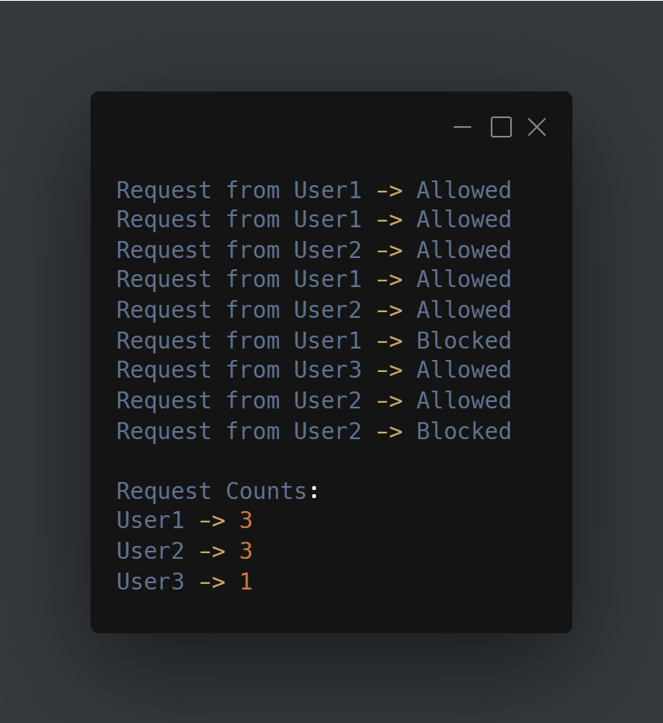

# API Rate Limiter

A Java simulation of API rate limiting that tracks user requests and blocks users after they exceed a predefined limit.

---

## How It Works

Each incoming request is associated with a user.

- If the user has not reached the request limit, the request is allowed.
- If the user has already reached the limit, the request is blocked.
- Request counts are tracked separately for each user.

---

## Features

- Tracks requests per user
- Enforces a maximum request limit
- Blocks requests that exceed the limit
- Displays request statistics
- Console-based simulation

---

## Example Output

  

---
## Concepts Used

- Java Collections
- HashMap
- Request Tracking
- Conditional Logic
- Object-Oriented Programming

---

## Why I Built This

Rate limiting is a common technique used by APIs and web services to control traffic and prevent abuse.

This project demonstrates a basic rate-limiting mechanism using simple Java data structures and logic.
